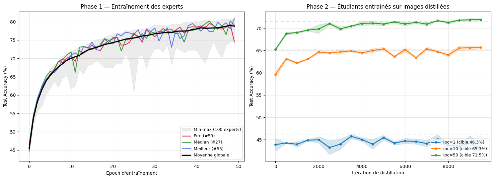

# MTT Reproduction — Dataset Distillation by Matching Training Trajectories (CIFAR-10)

Reproduction of the **MTT** method (Cazenavette et al., *Dataset Distillation by Matching Training Trajectories*, CVPR Workshop 2022) on **CIFAR-10**, carried out as a Master's project.

> **Original authors' code:** https://github.com/GeorgeCazenavette/mtt-distillation
> **Project page:** https://georgecazenavette.github.io/mtt-distillation/

---

## 1. Project topic

**Dataset distillation** aims to synthesize a very small set of artificial images (e.g. 1, 10 or 50 images per class) such that a network trained **only on these images** reaches a performance close to the one obtained with the full real dataset (50,000 images for CIFAR-10).

MTT produces these images by ensuring that training on the synthetic images **follows the same parameter trajectory** (the evolution of the network's weights during training) as training on the real data. This is the principle of *matching training trajectories*.

---

## 2. Method overview

The method has three phases.

**Phase 1 — Expert trajectories.** Several networks (ConvNet) are trained on the real CIFAR-10 and their weights are saved at every epoch. Each sequence of weights forms an *expert trajectory*: the reference that the synthetic images must imitate.

**Phase 2 — Distillation.** At each iteration: a "student" network is initialized at a random point of an expert trajectory, trained for a few steps on the synthetic images, then the distance between the resulting weights and the expert's weights a few epochs later is measured. This distance is used to update the pixels of the synthetic images (via backpropagation all the way down to the pixels). This is repeated thousands of times.

**Phase 3 — Evaluation.** Fresh networks are trained from scratch on the distilled images only, and their test accuracy is measured. the distilled images are also visualized.

The key idea is *long-range matching*: a few training steps on the synthetic images must match several epochs of real training, which forces the images to concentrate as much useful information as possible.

---

## 3. Repository content

| File | Role |
|------|------|
| `Train_code.ipynb` | Phase 1 (expert generation) + Phase 2 (distillation for ipc = 1, 10, 50) |
| `Visualisation.ipynb` | Phase 3: distilled-image visualization, learning curves, cross-architecture generalization |
| `Cazenavette_..._paper.pdf` | The reference paper |

Experiments were run on **Google Colab**, with results saved to Google Drive.

---

## 4. Reproducing the results

### Phase 1 — Train the experts (once)

```bash
python buffer.py --dataset=CIFAR10 --model=ConvNet \
  --train_epochs=50 --num_experts=100 --zca --save_interval=1 \
  --buffer_path=<buffers_path> --data_path=<data_path>
```

100 ConvNet networks trained for 50 epochs on CIFAR-10 (with ZCA), weights saved at every epoch.

### Phase 2 — Distill (for each ipc)

```bash
python distill.py --dataset=CIFAR10 --ipc=<1|10|50> \
  --Iteration=10000 --syn_steps=<50|50|30> --expert_epochs=2 \
  --max_start_epoch=<2|20|40> --zca \
  --lr_img=1000 --lr_lr=<1e-7|1e-5|1e-5> --lr_teacher=0.01 \
  --eval_it=500 --num_eval=3 --epoch_eval_train=1000 \
  --buffer_path=<buffers_path> --data_path=<data_path>
```

### Hyperparameters per configuration

| Parameter | ipc=1 | ipc=10 | ipc=50 |
|-----------|-------|--------|--------|
| `syn_steps` (N) | 50 | 50 | 30 |
| `expert_epochs` (M) | 2 | 2 | 2 |
| `max_start_epoch` | 2 | 20 | 40 |
| `lr_lr` | 1e-7 | 1e-5 | 1e-5 |
| `lr_img` | 1000 | 1000 | 1000 |
| `Iteration` | 10000 | 10000 | 10000 |

---

## 5. Results

### 5.1 Distilled images (CIFAR-10)

**1 image per class**
![Distilled images ipc=1]

**10 images per class**
![Distilled images ipc=10]

**50 images per class**
![Distilled images ipc=50]

At 1 image per class the images are highly abstract but still recognizable; with more images they become more structured and varied (consistent with Figure 4 of the paper).

### 5.2 Test accuracy vs paper target

| Images/class | Target (paper) | My reproduction | Gap |
|--------------|----------------|-----------------|-----|
| 1 | 46.3 % | **45.75 ± 0.47 %** | −0.55 |
| 10 | 65.3 % | **65.70 ± 0.30 %** | +0.40 |
| 50 | 71.5 % | **71.93 ± 0.22 %** | +0.43 |

All three configurations closely reproduce the paper's results: gaps are below one point, and the 10 and 50 images/class settings even slightly exceed the target. The small negative gap at 1 image/class (−0.55) stays within the uncertainty margin.

> _Insert here the learning-curves figure (Phase 1 experts + Phase 2 students) produced by `Visualisation.ipynb`._



### 5.3 Cross-architecture generalization (10 images/class)

Images distilled with a ConvNet, then evaluated by training other architectures.

| Architecture | Paper (Table 3) | My reproduction | Gap |
|--------------|-----------------|-----------------|-----|
| ConvNet | 64.3 ± 0.7 % | **63.88 ± 0.27 %** | −0.42 |
| ResNet18 | 46.4 ± 0.6 % | **44.62 ± 0.77 %** | −1.78 |
| VGG11 | 50.3 ± 0.8 % | **49.53 ± 0.69 %** | −0.77 |
| AlexNet | 34.2 ± 2.6 % | **30.76 ± 3.88 %** | −3.44 |

This test checks that the distilled images do not overfit a single architecture. The gaps remain small and the results follow the same ranking as the paper (ConvNet > VGG11 > ResNet18 > AlexNet), confirming the good generalization of the distilled images.

---

## 6. Scope and reproduction choices

**Reproduced:** the full method on CIFAR-10 (expert generation, distillation for 1/10/50 images per class, image visualization, learning curves, cross-architecture generalization).

**Out of scope:** CIFAR-100, Tiny ImageNet and the 128×128 ImageNet subsets (Table 4, Figures 6–7), as well as the M/N ablation of Figure 5 and the direct comparison with KIP.

**Practical adaptations (Colab):** compared to the code defaults, `num_eval` was reduced from 5 to 3 and `eval_it` raised from 100 to 500 to limit compute time. This does not affect the quality of the produced images, only the frequency and precision of the monitoring during distillation.

---

## 7. Reference

> George Cazenavette, Tongzhou Wang, Antonio Torralba, Alexei A. Efros, Jun-Yan Zhu.
> *Dataset Distillation by Matching Training Trajectories.* CVPR Workshops, 2022.
